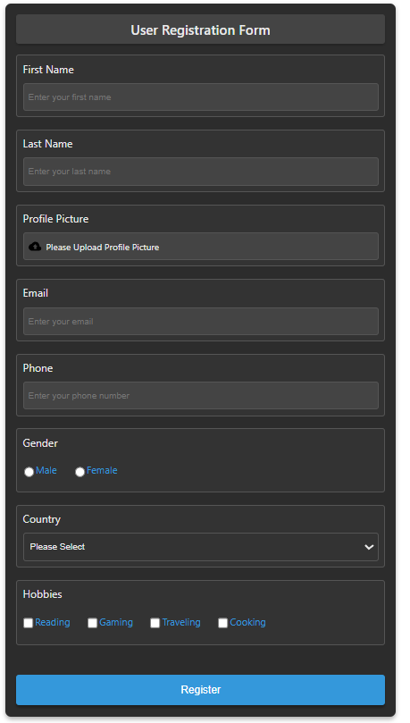

<html>
<h1>Form Creator</h1>
     
    <h2>Description</h2>
    <h4>
    Form Creator is a project designed to simplify form creation and reuse by allowing users to generate forms effortlessly with a  JSON file. It supports custom designs for each form component, input validation using Yup, and a rich text editor powered by Jodit.
    </h4>
     
    <h2>List of Features</h2>
        <ul>
            <li>Very customizable design options</li>
            <li>Yup validation to validate inputs</li>
            <li>Simplicity of use by using JSON to build the forms</li>
            <li>Simple reusability of form designs across a website</li>
            <li>Default Design Available</li>
            <li>Integrated rich text editor using Jodit</li>
        </ul>
    <h2>Preview</h2>
     
    <h3>Example Forms</h3>
     
    
    
</html>
